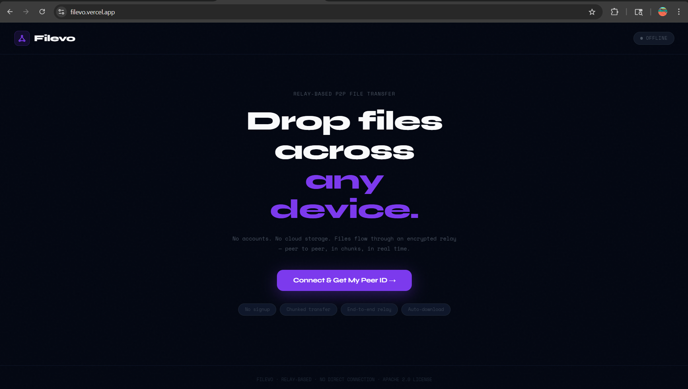

# Filevo 🔗

> Send files to anyone, anywhere. No signup. No cloud. No limits.

[](https://filevo.vercel.app)



Filevo is a relay-based peer-to-peer file transfer app. Files are split into chunks in the browser, streamed through a lightweight Python relay server, and auto-downloaded on the receiver's end. Nothing is ever stored on the server.

---

## Tech Stack

- **Backend** — Python, FastAPI, WebSockets, asyncio
- **Frontend** — React, Vite
- **Infra** — Docker

---

## Getting Started

### 1. Backend

```bash
cd backend
python -m venv venv
source venv/bin/activate      # Windows: venv\Scripts\activate
pip install -r requirements.txt
cp .env.example .env
python -m server.main
```

Relay server runs at `ws://localhost:8000/ws`

### 2. Frontend

```bash
cd frontend
npm install
cp .env.example .env
npm run dev
```

App runs at `http://localhost:3000`

---

## How to Use

1. Open `http://localhost:3000` in **two browser tabs**
2. Both tabs click **Connect** to get a Peer ID
3. **Tab 1 (Receiver)** — copy the Peer ID
4. **Tab 2 (Sender)** — drop a file, paste the Peer ID, click **Send**
5. File auto-downloads in Tab 1 ✅

---

## Project Structure

```
filevo/
├── backend/
│   ├── server/
│   │   ├── main.py          # FastAPI app + WebSocket endpoint
│   │   ├── relay.py         # Forwards chunks between peers
│   │   └── peer_manager.py  # Tracks connected peers
│   ├── file_engine/
│   │   ├── chunker.py       # Splits files into chunks
│   │   ├── assembler.py     # Reassembles chunks into file
│   │   └── hasher.py        # SHA-256 integrity check
│   ├── client/
│   │   ├── main.py          # CLI entry point
│   │   ├── uploader.py      # CLI send
│   │   └── downloader.py    # CLI receive
│   ├── requirements.txt
│   ├── Dockerfile
│   └── docker-compose.yml
└── frontend/
    ├── src/
    │   ├── App.jsx
    │   ├── components/
    │   │   ├── UploadBox.jsx
    │   │   ├── DownloadBox.jsx
    │   │   └── ProgressBar.jsx
    │   └── services/
    │       └── socket.js
    └── package.json
```

---

## CLI (Optional)

Send and receive files from the terminal without the browser.

```bash
# Receiver — run first, note the Peer ID it prints
python -m client receive

# Sender
python -m client send myfile.zip filevo_abc123
```

---


## Environment Variables

**Backend** (`backend/.env`)

| Variable | Default | Description |
|---|---|---|
| `HOST` | `0.0.0.0` | Server host |
| `PORT` | `8000` | Server port |
| `LOG_LEVEL` | `info` | Log level |

**Frontend** (`frontend/.env`)

| Variable | Default | Description |
|---|---|---|
| `VITE_WS_URL` | `ws://localhost:8000/ws` | Relay server URL |

---

## License

Licensed under the **Apache License 2.0** — free to use, modify and distribute with attribution. See [LICENSE](LICENSE) for details.

---

## Author

Made by **Rajat Surana**

[](https://linkedin.com/in/rajat-surana)
[](https://github.com/rajatsurana19)
